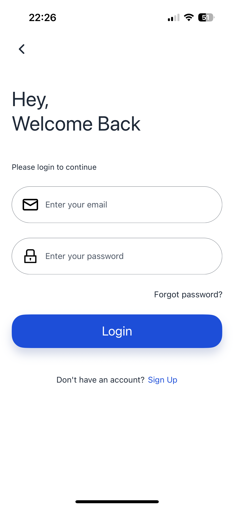
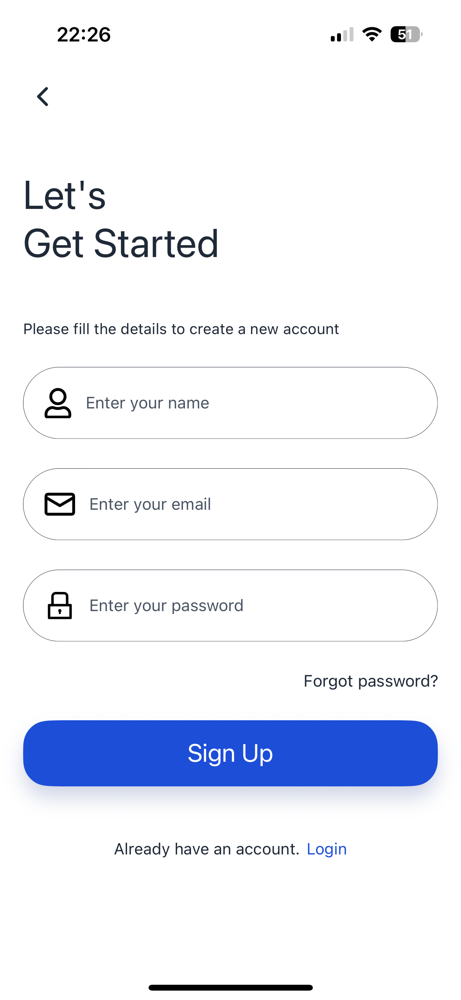
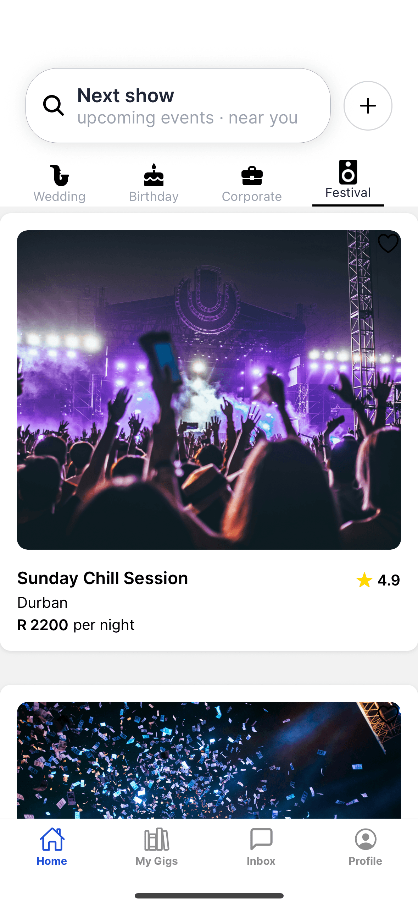
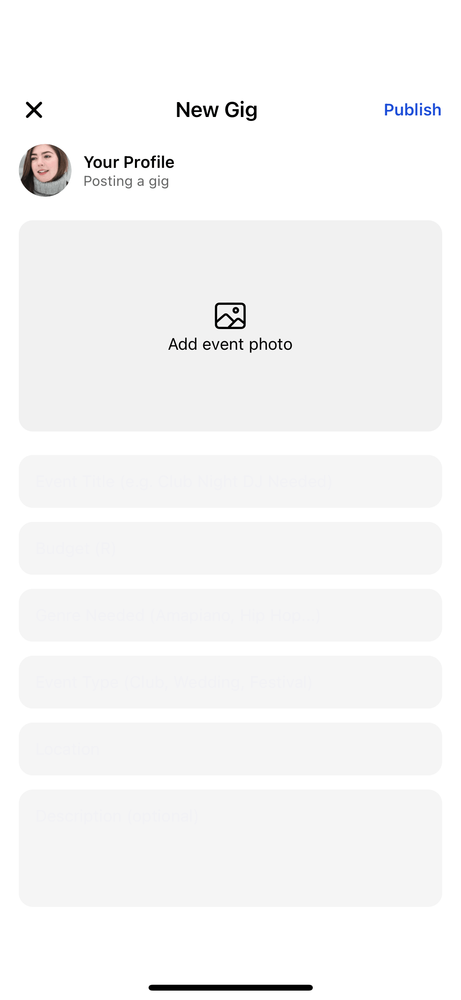

# ProximaBook 🎧

A full-stack DJ booking platform that connects DJs with event promoters.

---

## 🚀 Features

- User authentication (DJ / Promoter roles)
- DJ profiles
- Gig posting system
- DJ applications to gigs
- Booking management dashboard
- Real-time updates (optional)

---

## 🛠️ Tech Stack

- Frontend: React
- Backend: Supabase
- Database: PostgreSQL
- Auth: Supabase Auth

---

## 📸 Screenshots

### 🔐 Login Page


### 🔐 SignUp Page


### 📊 Dashboard


### ➕ Create Gig


### 📩 Applications


---

## ⚙️ Installation

```bash
git clone https://github.com/Calvin760/GigGuide.git
cd GigGuide
npm install
npm run dev